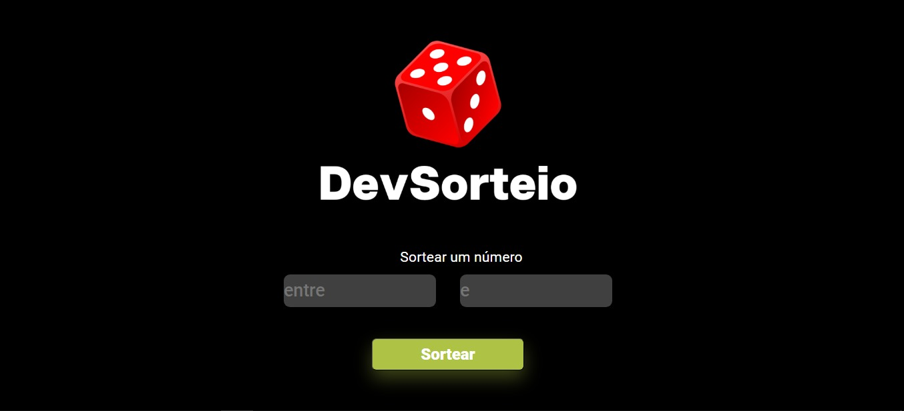

<h1>Site para números sorteados</h1>

Nesse projeto usei as seguintes linguagens: HTML,CSS e JavaScript.
Com ele aprendi a importancia da ferramenta Random porque com ela é possivel realizar o uso de numeros aleatorios digitados pelo usuário para realização de um sorteio profissional.

